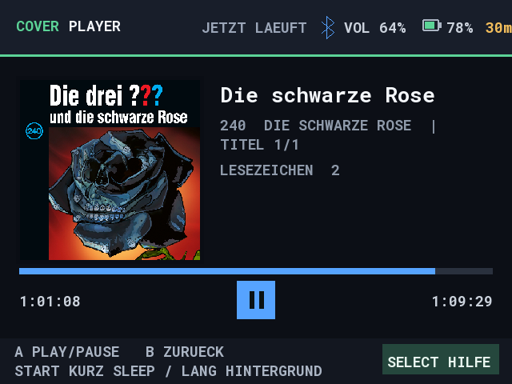
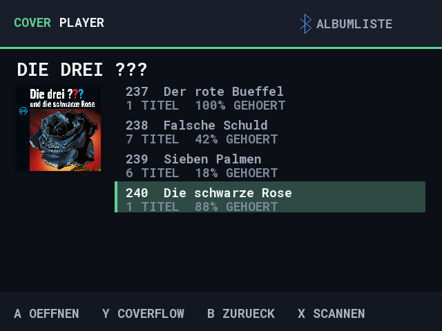
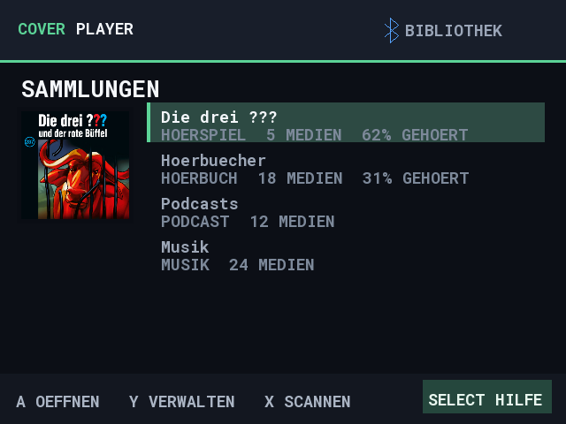
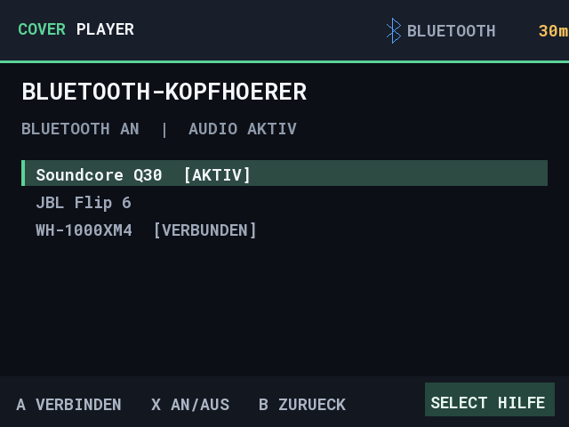
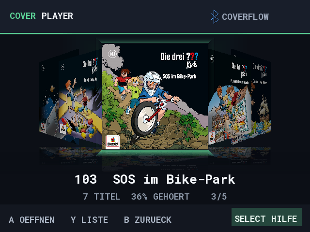
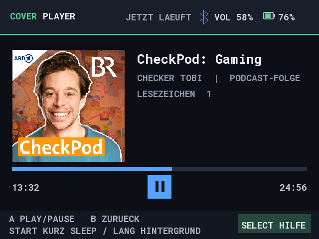
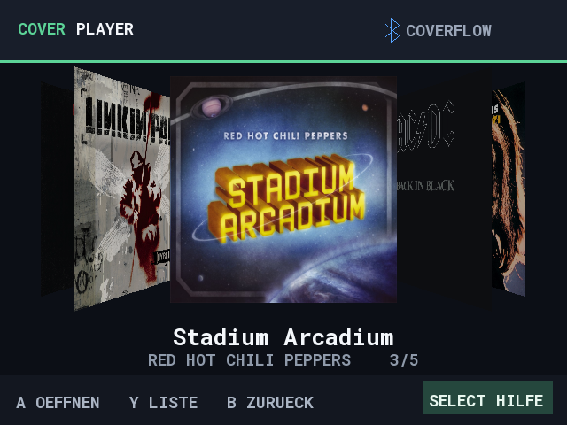
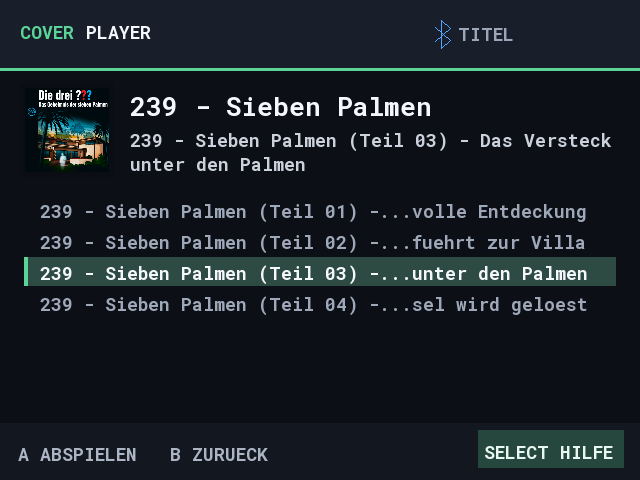
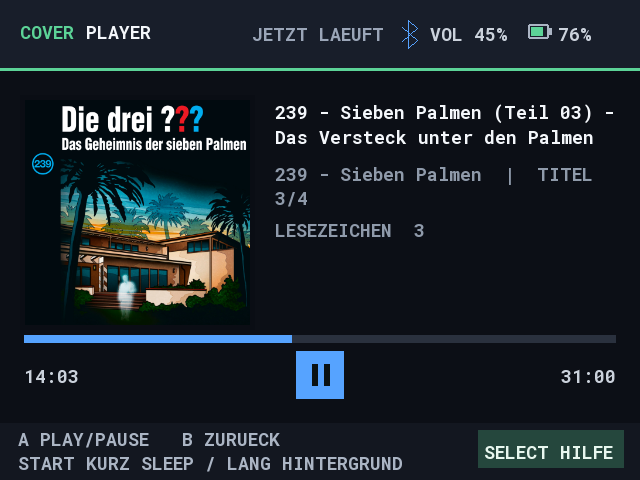

# CoverPlayer


CoverPlayer is an offline audio player made for handheld game systems. It puts
your audiobooks, radio plays, podcasts, and music in a cover-first library you
can navigate with a controller. Knulli is the primary target; muOS support has
also been tested on a handheld.

[Download a release](https://github.com/heilmic/CoverPlayer/releases) ·
[Release notes](CHANGELOG.md) ·
[Installation and controls](packaging/README.md) ·
[Support development on Ko-fi](https://ko-fi.com/heilmic)

## What it does

- Organize several folders as named collections, such as “Audiobooks”,
  “Podcasts”, or an artist's albums. Your files stay where they are.
- Browse folders at any depth in CoverFlow or switch to a simple list. The
  track list appears when you reach the music or audiobook files.
- Show folder or embedded cover art, with a fallback when a collection has no
  cover of its own.
- Resume where you stopped, follow multi-track albums automatically, add
  bookmarks, and set a sleep timer.
- Scan collections again when files change. A library cache keeps ordinary
  starts quick.
- On Knulli and muOS, continue playing an active track in the background while using
  other apps, then reopen CoverPlayer to take playback back.

## Library and playback

Add a collection from the collection screen with **Y**, choose its folder and
give it a name. Open it with **A**. Use **Y** again in the library to switch
between CoverFlow and list view; **B** takes you back. Previously played tracks
resume from their saved position.

The player shows your place in the current track. Playback progress and
bookmarks are saved separately from your media, so reinstalling CoverPlayer
does not require moving your collection folders. The bottom bar shows the
main buttons on each screen and keeps **Select: Help** visible. The help page
shows all buttons for the current screen. Press **Y** there to switch between
German and English; the choice is saved for the next launch.

## Background playback and Bluetooth

On Knulli or muOS, hold **Start** for two seconds while a track is playing to leave
the app with playback running. A short press of Start changes the sleep timer;
**Start + Select** exits without background playback. Reopening CoverPlayer
returns playback to the app. Bluetooth management is available for devices
already paired through Knulli's system menu.

Game-audio balancing during background playback is still experimental on
Knulli and is not enabled on muOS. If needed, lower game audio in RetroArch.
A safer solution is tracked in [TODO.md](TODO.md).

## Screenshots

[English interface and audiobook demo gallery](docs/screenshots/generated/en/README.md)
· [German demo screenshots](docs/screenshots/generated)

| English audiobook library | English playback |
| --- | --- |
|  |  |

| Now playing | Album list |
| --- | --- |
|  |  |

| Collections | Bluetooth |
| --- | --- |
|  |  |

| Audiobooks | Podcasts | Music |
| --- | --- | --- |
|  |  |  |

| Multi-track titles | Long title while playing |
| --- | --- |
|  |  |

These are illustrative images rendered by the actual interface with example
library entries, not a media library supplied with the app. Downloaded
full-resolution cover files are not in this repository or the packages. Cover
art shown in screenshots belongs to its respective rights holders.

## For developers

The portable application core is C++17. Platform-specific filesystem, audio,
controller, and system features stay behind interfaces. See
[architecture](docs/architecture.md) for the design.

For a desktop build, install CMake, Ninja, a C++17 compiler, and SDL2, then run:

```sh
cmake --preset desktop-debug
cmake --build --preset desktop-debug
```

On Windows, `./scripts/Build-And-Test.ps1` runs the desktop tests and builds
the Knulli and muOS archives. It needs MSYS2 UCRT64, Python, and Docker
Desktop. Pass `-Mp3Path <file>` to include the optional real-file seek test.
This does not install anything on a handheld. See the
[package notes](packaging/README.md) for installation details. Future
Switch/PortMaster ports remain open work.

The repeatable Windows workflows are:

```powershell
./scripts/Build-And-Test.ps1
./scripts/Generate-DemoScreenshots.ps1
./scripts/Generate-DemoScreenshots.ps1 -Language en
./scripts/Deploy-Knulli.ps1 -IncludeTest
./scripts/Deploy-muOS.ps1
./scripts/Publish-Release.ps1 -Tag v0.1.0-rc.4 -DryRun
```

The screenshot command uses locally supplied cover files in
`docs/screenshots/source-covers`; those source files are ignored by Git. Copy
`scripts/deploy.example.json` to `scripts/deploy.local.json` and enter your
device addresses and optional SSH host-key fingerprints. This local file is
also ignored by Git. The deployment commands prompt for SSH passwords, refuse
a running player, and verify uploaded package hashes. Add `-Build` to run tests
and rebuild before deployment, or `-PreflightOnly` to validate packages
without contacting a device. Knulli targets the configured handhelds by
default. For an actual
GitHub release, add its section to `CHANGELOG.md`, commit the changes, and run
`Publish-Release.ps1` with the new tag and without `-DryRun`; it builds, tests,
verifies, tags, and uploads the three packages. Existing tags are not replaced.

CoverPlayer is licensed under [Apache-2.0](LICENSE). Bundled dependencies and
their notices are listed in [THIRD_PARTY_NOTICES.md](THIRD_PARTY_NOTICES.md).

If CoverPlayer is useful to you, you can [support the project on
Ko-fi](https://ko-fi.com/heilmic).
