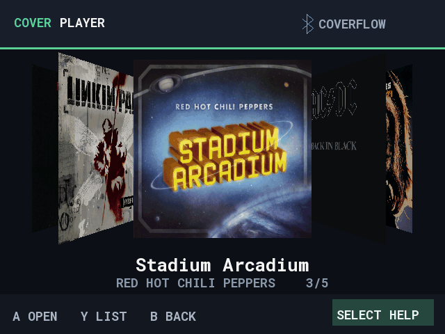

# CoverPlayer

**1.0.0 — First stable release**, built and tested primarily for Knulli handhelds.

An offline MP3 player for handheld game systems: browse music, audiobooks,
radio plays and podcasts with a controller. **Knulli is the primary platform**;
muOS also supports library browsing and background playback. An experimental
[Nintendo Switch / Switch Lite NRO](docs/switch.md) is available in the same release.

[Download](https://github.com/heilmic/CoverPlayer/releases) ·
[Install & controls](packaging/README.md) · [Documentation](docs/README.md) ·
[Release notes](CHANGELOG.md)

## Features

- CoverFlow and list views for your own folders, organized as named collections.
- Resume playback, bookmarks, automatic next track and a sleep timer.
- Keep listening while choosing another track in the same album; per-track artwork in the player.
- Background listening while playing games; Knulli lowers game audio by about 6 dB.
- Screen dimming during playback, with normal standby restored when playback stops.
- German and English controls; Bluetooth management for devices paired in Knulli.

## Get started

1. Install the [package for your firmware](packaging/README.md#install).
2. Press **Y** on the collection screen to add a media folder.
3. Open a collection with **A**. Press **Select** for help on any screen.

Hold **Start** for two seconds during playback to keep listening in the
background. Reopen CoverPlayer to return to the player.

Want a dedicated Knulli main-menu category? Use **CoverPlayer-Knulli-Category.zip**
instead of the regular ZIP. [Setup, screenshot and optional player icon](docs/knulli-category.md).

## Screenshots

| Music library | Audiobook playback |
| --- | --- |
|  |  |

[English gallery](docs/screenshots/generated/en/README.md) ·
[German gallery](docs/screenshots/generated/README.md)

The GIF and screenshots use the native 640 × 480 interface with example media.
Audio and original cover files are not supplied. Artwork belongs to its
respective rights holders; [cover sources](docs/screenshots/demo-cover-sources.md).

## Development

C++17 and SDL2. See the [build, test and deployment guide](docs/development/README.md),
[architecture](docs/architecture.md) and [roadmap](TODO.md).
The main branch can contain changes newer than the latest downloadable release.

The [Switch alpha 5](docs/switch.md) uses a dedicated 1280 × 720 interface.
Collection creation and playback have been confirmed on Switch; Lite, docking
and extended lifecycle tests remain pending. [Install and controls](packaging/switch/README.md).

[Apache-2.0](LICENSE) · [Third-party notices](THIRD_PARTY_NOTICES.md) ·
[Support on Ko-fi](https://ko-fi.com/heilmic)
