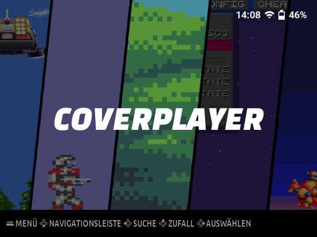
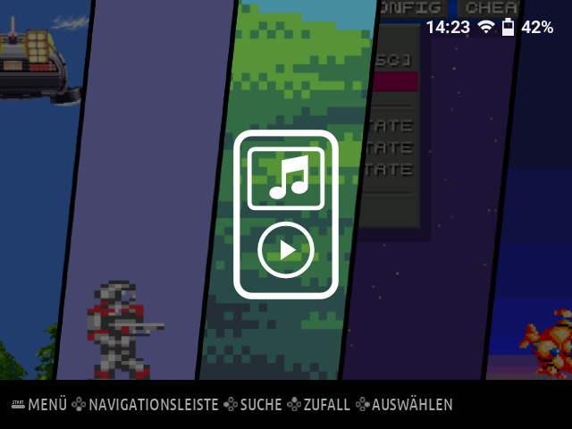

# CoverPlayer as a Knulli category

**Download `CoverPlayer-Knulli-Category.zip` from the
[release assets](https://github.com/heilmic/CoverPlayer/releases/latest).**
This is a complete alternative to `CoverPlayer-Knulli.zip`: the same regular
app, plus a dedicated CoverPlayer category on Knulli's main carousel.
You do not need to install both packages. It does not install CoverPlayer-Test.

## Install

1. Close CoverPlayer, including any background playback.
2. Extract the ZIP into Knulli's network share (`\\KNULLI\share`) or the
   mounted userdata partition. Merge the included `roms`, `system` and
   `theme-customizations` folders with the existing folders.
3. In Knulli, update the game lists. The CoverPlayer category contains one
   entry: select the category, then select CoverPlayer to start the app.

The existing Ports entry remains available. Both entries use
`roms/ports/CoverPlayer/` and the same saved settings, collections and progress.
CoverPlayer-Test remains separate. Installing this package over the regular
package updates that installation; it does not create another player copy.

## Optional player icon: Art Book Next

The ZIP includes an original, white SVG MP3-player symbol under
`theme-customizations/art-book-next/logos/coverplayer.svg` (Apache-2.0).
It is drawn with basic vector shapes and needs no emoji font.

With **Art Book Next** selected, open its theme configuration and set
**System Logos → Custom**. This activates the supplied icon. This setting
also enables any other custom logos you already have. Leave **System Artwork**
as it is; the screenshot uses the theme's standard background.

The package does not change theme settings or firmware files. Other themes
may show the category name or their own default artwork; this depends on the
theme. The included SVG can be reused in a theme-specific integration.
Category navigation, launch and the optional Art Book Next icon were tested
on a Knulli RG35XX-H. Themes without a suitable fallback need their own setup.

## Remove only the category

Delete `system/configs/emulationstation/es_systems_coverplayer.cfg` and
`roms/coverplayer/CoverPlayer.sh` plus `roms/coverplayer/gamelist.xml`.
Remove `roms/coverplayer` if it is empty, then update the game lists.
The optional SVG can also be removed. Keep `roms/ports/CoverPlayer/`, its
Ports launcher, your media and saved application data.
