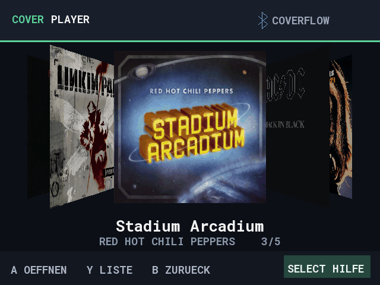
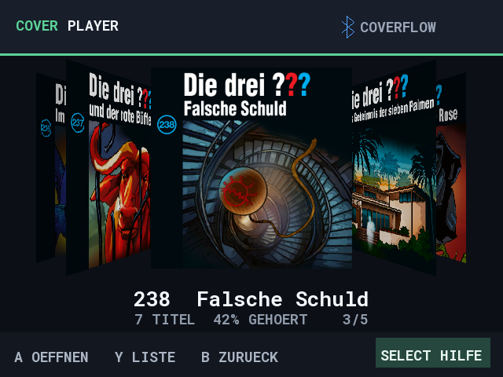
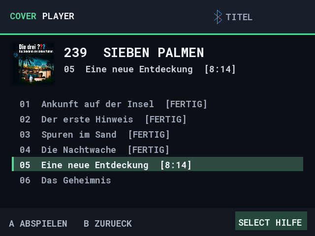
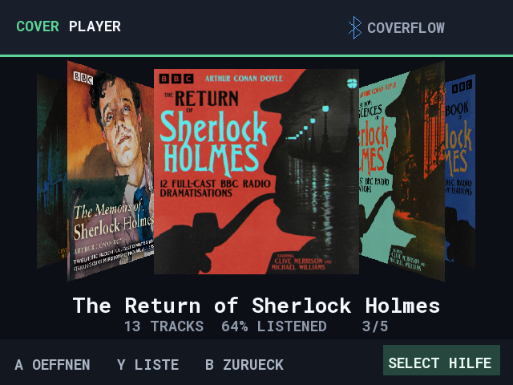
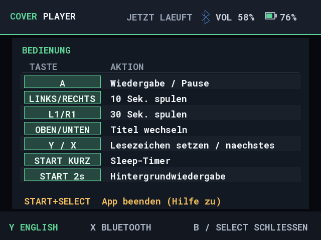
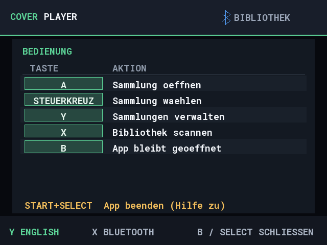

# Deutsche Demo-Screenshots

Neu gerendert am 10.10.2026 mit dem aktuellen SDL-Renderer, in 640 x 480.
Die drei ???, Die drei ??? Kids, CheckPod, Sherlock Holmes und Musik dienen
als Beispielsammlungen. Wiedergabedaten und Tracknamen sind Demo-Daten.

[Englische Galerie](en/README.md) · [Cover-Quellen](../demo-cover-sources.md)

Neu erzeugen: `./scripts/Generate-DemoScreenshots.ps1 -Language de -IncludeGif`.

## CoverFlow

## Sammlungen

## Albumliste

## Titelliste

## Wiedergabe

## Bluetooth

## Die drei ??? Kids

## Podcast

## Sherlock Holmes

## Musik

## Wiedergabe-Hilfe

## Sammlungs-Hilfe

## Lange Tracknamen

## Langer Titel bei der Wiedergabe

