# English demo screenshots

English interface at the native 640 x 480 resolution. The audiobook examples
use English covers; German media retain their original titles. Chapter names
and playback data are fictional examples, not official chapter listings.

Regenerate with `./scripts/Generate-DemoScreenshots.ps1 -Language en`.

## Audiobook CoverFlow

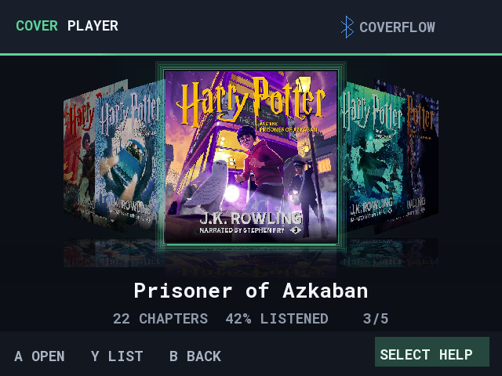

## Collections

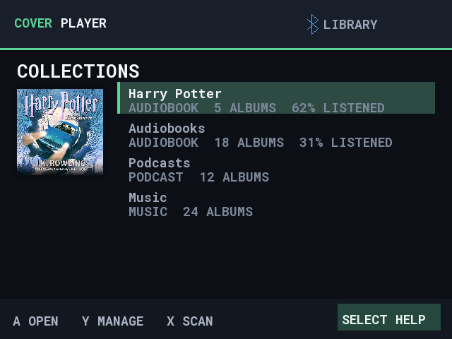

## Album list

## Chapter list

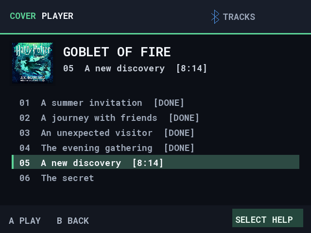

## Now playing

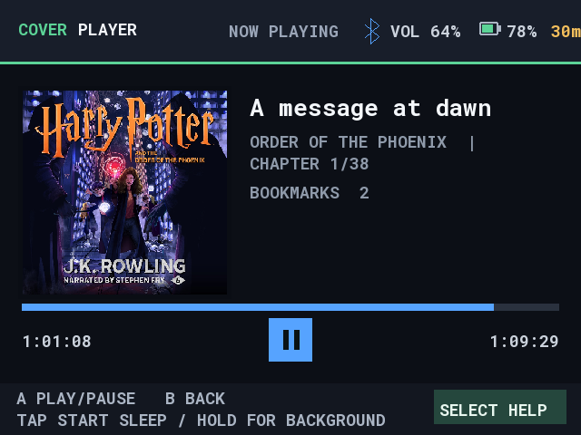

## Bluetooth

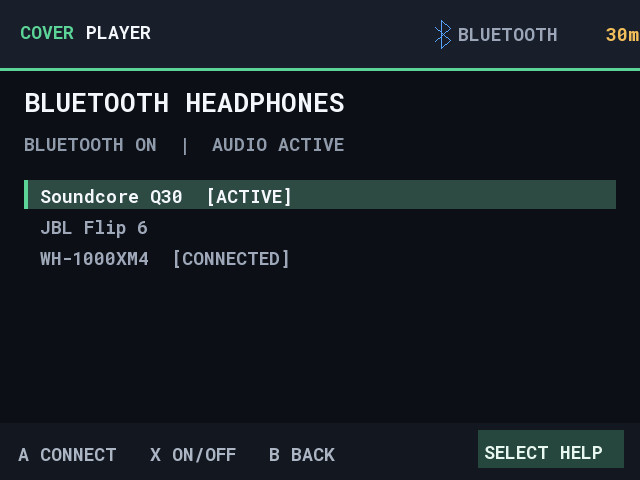

## German children's audio with English controls

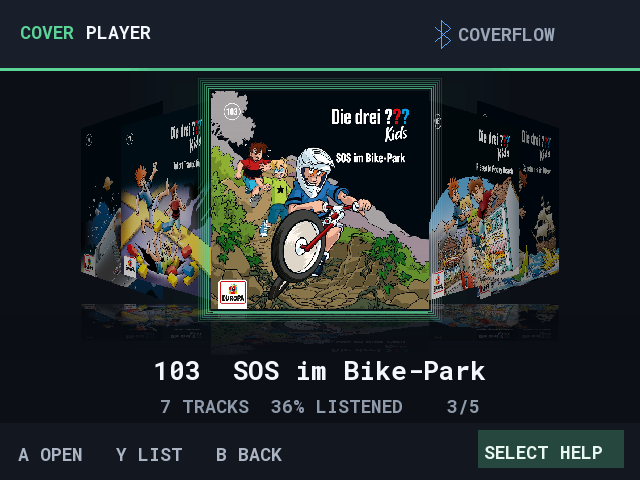

## Podcast with English controls

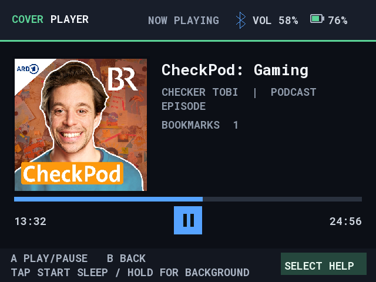

## International audiobooks

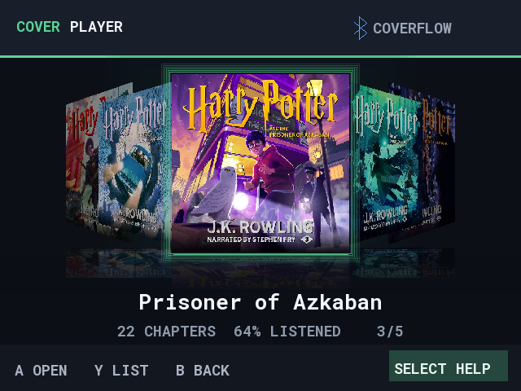

## Music CoverFlow

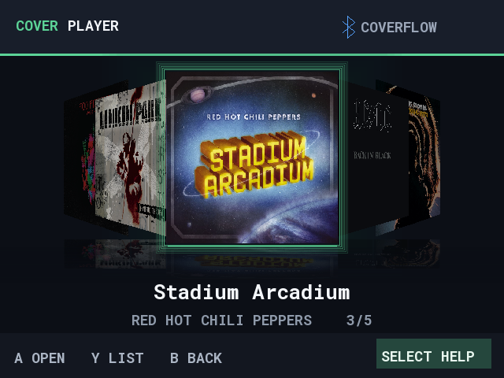

## Playback help

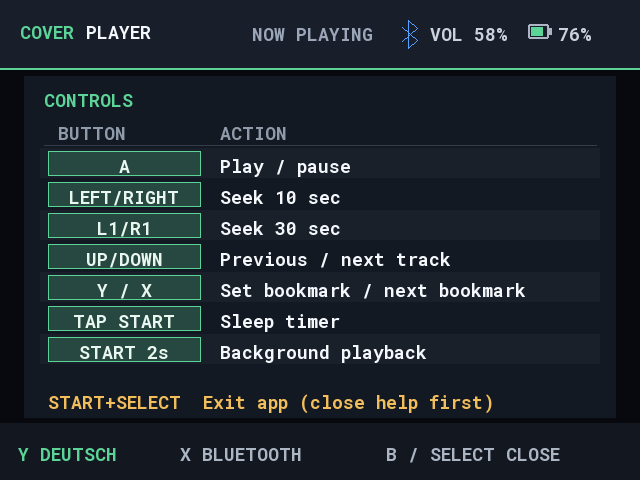

## Collection help

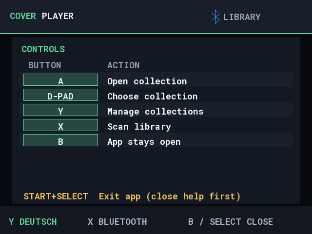

## Long chapter titles

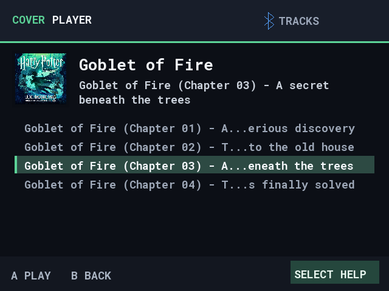

## Long title during playback

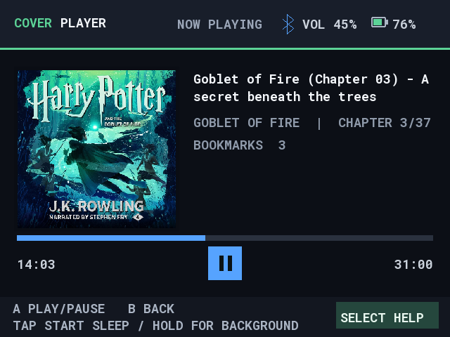

