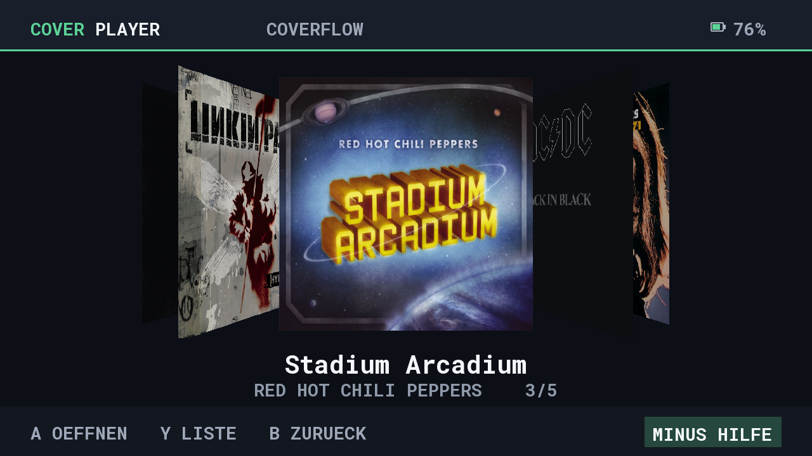
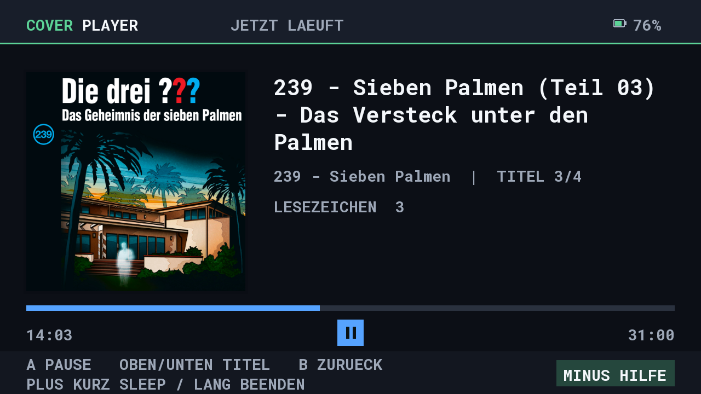

# Nintendo Switch alpha

The first Switch build is a normal **NRO foreground player**, based on the
shared SDL2 interface and MP3 player. It targets original Switch and Switch
Lite. Alpha 1 launched on the user's device, but saving collections failed.
Alpha 2 replaces SDL's unavailable preference-path API with explicit SD paths
for state, cache and embedded covers. The user confirmed collection creation
and MP3 playback on Switch, and the 16:9 layout was reviewed on the device. Alpha 3 hides the VOL indicator in favor of the
system volume overlay. Alpha 4 adds a dedicated 1280 x 720 widescreen interface
with larger, directly rendered fonts. Switch Lite testing remains pending. Installation, controls and
the device-test checklist are in [the Switch package guide](../packaging/switch/README.md).

Knulli/muOS power helpers, shell commands, background processes, system-volume
access and Bluetooth pairing are excluded. Switch volume and Bluetooth audio
remain system-managed. Auto-sleep is disabled only while audio is actively
playing, and restored when paused or stopped and on exit. Focus loss pauses
and saves playback; return to the app resumes it. There is no custom screen
dimming. The interface uses the full 16:9 display, with a 1280 x 720 logical
canvas that scales uniformly when docked.

The user also reports working background playback in applet mode. Record this
as device feedback: the exact HOME/game/focus conditions and compatibility in
full application mode still need verification. Alpha 5 preserves that behavior.

## Alpha 5 playback changes

Returning from the player to an album's track list keeps audio playing.
Leaving that list for the album browser pauses and saves progress. A one-track
album still returns directly to the browser and pauses. Selecting the running
track returns to the player without reopening the file; choosing another saves
the outgoing position. Automatic next-track playback also works in the list,
independently of the highlighted row.

The player prefers the current track's embedded cover, falling back to the
album cover and then the placeholder. Album browsing keeps its existing cover
priority. Library cache version 5 retains per-track artwork; older caches are
rebuilt automatically without changing collections or playback progress.
Management now shows X/Delete in its footer, and the player shows Up/Down for
track switching. Alpha 5 hardware validation remains pending.

## Build

Docker must be running, with Python 3 available on the host:

```powershell
./scripts/Build-Switch.ps1
```

The script uses a pinned official devkitPro Docker image, builds with
`/opt/devkitpro/cmake/Switch.cmake`, and produces:

- `build/release/CoverPlayer-Switch-1.0.0-alpha5.zip`: SD-card installation ZIP,
  license notices, corresponding application/decoder sources and relink script.
- `build/release/CoverPlayer-Switch-1.0.0-alpha5.nro`: standalone executable.
- `build/release/CoverPlayer-Switch-1.0.0-alpha5.zip.sha256`: ZIP checksum.

The package step validates AArch64 ELF, NRO magic and boundaries, icon, NACP
metadata and embedded font, then verifies every file in the ZIP. Shared desktop
tests remain in `scripts/Build-And-Test.ps1 -SkipPackages`.

## Switch display layout

Body text uses a 28-point font and headings use 40 points, rasterized directly
at the new size. This avoids enlarging the old 640 x 480 text textures.
A 48-pixel horizontal margin, high contrast and separate header/content/footer
areas keep controls readable. Long player titles wrap; file lists preserve
the selected filename in a separate detail area. CoverFlow retains its existing
perspective and easing, with 400-pixel selected covers and artwork decoded up
to 512 pixels per side. The 16-entry Switch cover cache bounds RGBA artwork to
about 16 MiB.

Typography is informed by [Xbox Accessibility Guideline 101](https://learn.microsoft.com/en-us/gaming/accessibility/xbox-accessibility-guidelines/101),
including its 26-pixel minimum text-body height at 1080p. Font point size and
visible glyph height differ; this is a design reference, not a compliance
claim. Readability on the smaller Lite screen still needs device feedback.

The widescreen renderer is compiled only into Switch builds. Knulli and muOS
keep their existing layout, font sizes, cover limits and dependencies. An
optional desktop preview target enables the Switch renderer for visual review:

```powershell
cmake -S . -B build/switch-preview -G Ninja -DCMAKE_BUILD_TYPE=Release -DCOVERPLAYER_BUILD_TESTS=OFF -DCOVERPLAYER_BUILD_SWITCH_PREVIEW=ON
cmake --build build/switch-preview --target coverplayer_switch_preview
./build/switch-preview/coverplayer_switch_preview.exe build/switch-layout-review docs/screenshots/source-covers de
```

The screenshots below are desktop previews of the actual Switch renderer,
not captures from a Switch. Demo cover images are only used for previews and
are not bundled with the app.




## Deploy over FTP

Close CoverPlayer and start an FTP server on the Switch. For ftpd, use the IP
and port shown on its screen (often port 5000). Copy
`scripts/deploy-switch.example.json` to `scripts/deploy-switch.local.json` and
enter the connection details. The local file is excluded from Git.

```powershell
./scripts/Deploy-Switch.ps1          # upload the existing build
./scripts/Deploy-Switch.ps1 -Build   # build, package and upload
```

For a one-off connection, use `-Address 192.168.10.123 -Port 5000`.
The uploader transfers only the NRO, verifies it by downloading and comparing
SHA-256, then replaces `/switch/CoverPlayer/CoverPlayer.nro`. It keeps the old
binary as `CoverPlayer.nro.previous` and attempts rollback on rename failure.
Settings and media are untouched. Stop FTP and launch the app yourself.
The upload logic is tested with `python tests/switch_deploy_test.py`;
an actual Switch connection must also be tested.

## Ultrahand / Tesla background playback

[Ultrahand](https://github.com/ppkantorski/Ultrahand-Overlay) supports Tesla
overlays. A small overlay alone is insufficient for persistent playback:
the audio engine must run as an independent sysmodule when the overlay closes
or a game is running. The full SDL CoverFlow interface stays in the NRO.

[sys-tune](https://github.com/ppkantorski/sys-tune) demonstrates background
audio with an Ultrahand/Tesla control overlay and exposes an
[IPC interface](https://github.com/ppkantorski/sys-tune/tree/master/ipc).
A later CoverPlayer integration can evaluate that service or use a dedicated
audio sysmodule, with IPC for playlist, playback, seeking and progress.
That requires separate compatibility and lifecycle tests; it is not included
in this first NRO or installed by its ZIP.

Toolchain: [devkitPro Docker images](https://github.com/devkitPro/docker),
[libnx](https://github.com/switchbrew/libnx),
[Switch SDL2 port](https://github.com/devkitPro/SDL/tree/switch-sdl-2.28).
